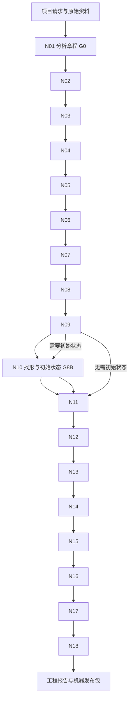

# 工作流图

```mermaid
flowchart TD
  U[项目请求与原始资料] --> N01[N01 分析章程 G0]
  N01 --> N02
  N02 --> N03
  N03 --> N04
  N04 --> N05
  N05 --> N06
  N06 --> N07
  N07 --> N08
  N08 --> N09
  N09 --> N10
  N10 --> N11
  N11 --> N12
  N12 --> N13
  N13 --> N14
  N14 --> N15
  N15 --> N16
  N16 --> N17
  N17 --> N18
  N09 -->|需要初始状态| N10[N10 找形与初始状态 G8B]
  N09 -->|无需初始状态| N11
  N10 --> N11
  N18 --> R[工程报告与机器发布包]
```

任何节点进入 `BLOCKED` 时，其后代节点停止。变更从首个受影响节点重跑，并强制复评 G11、G13、G15 和 G16。
