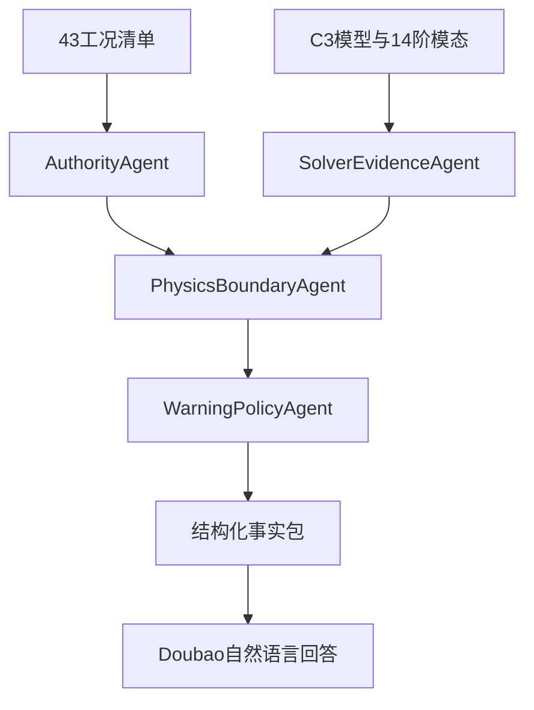

# C3 43 工况图谱与智能体说明

## 数据流

`cases_43.csv` 提供风事件事实；`model_binding.json` 提供 C3 模型和模态事实；`c3_agent.py` 对每个工况执行四个确定性智能体，然后构造 Doubao 可读取的事实包。

## 迁移规则

- 工况 ID、风速、阵风、等级和 C3 分层进入新图谱。
- 四智能体名称和职责进入新图谱，每个工况生成 4 个新决策，共 172 个。
- C3 deck、求解器、DAT、14 阶模态和哈希进入模型证据节点。
- Double‑MCT 的 43 个结果仅生成 `LegacyResultPointer`，关系为 `PROVENANCE_ONLY`。
- C3 的 43 个 `CaseResponse` 节点状态统一为 `NOT_MATERIALIZED`。
- 非平稳工况输出 `REFERENCE_ONLY_NONSTATIONARY`；其余工况输出 `AWAITING_C3_CASE_RESPONSE`。
- 43 个最终状态均为 `NOT_ARMED`，且 `dispatch=false`。

## 查询范围

Demo 可以回答：工况事实、风速相对量级、C3 模型身份、原生模态、四智能体路径、当前缺失证据、旧结果为何不能转抄。

Demo 不输出：C3 位移 RMS、C3 索力、C3 支反力、C3 安全比、正式运行预警等级。

## Doubao 接口

调用使用火山方舟 OpenAI 兼容 Chat API：`/api/v3/chat/completions`。默认模型为 `doubao-seed-1-8-251228`。系统消息要求模型只依据结构化事实包作答，并保留 `NOT_MATERIALIZED`、`NOT_ARMED` 和 `dispatch=false`。

## GitHub Demo

推送本目录或工作流后，Actions 自动执行：

1. 重建图谱；
2. 校验 43 工况、172 决策和所有边端点；
3. 运行单元测试；
4. 生成两个离线问答；
5. 检测仓库 Secret 并调用 Doubao；
6. 上传完整 `generated/` 与 Demo JSON。

