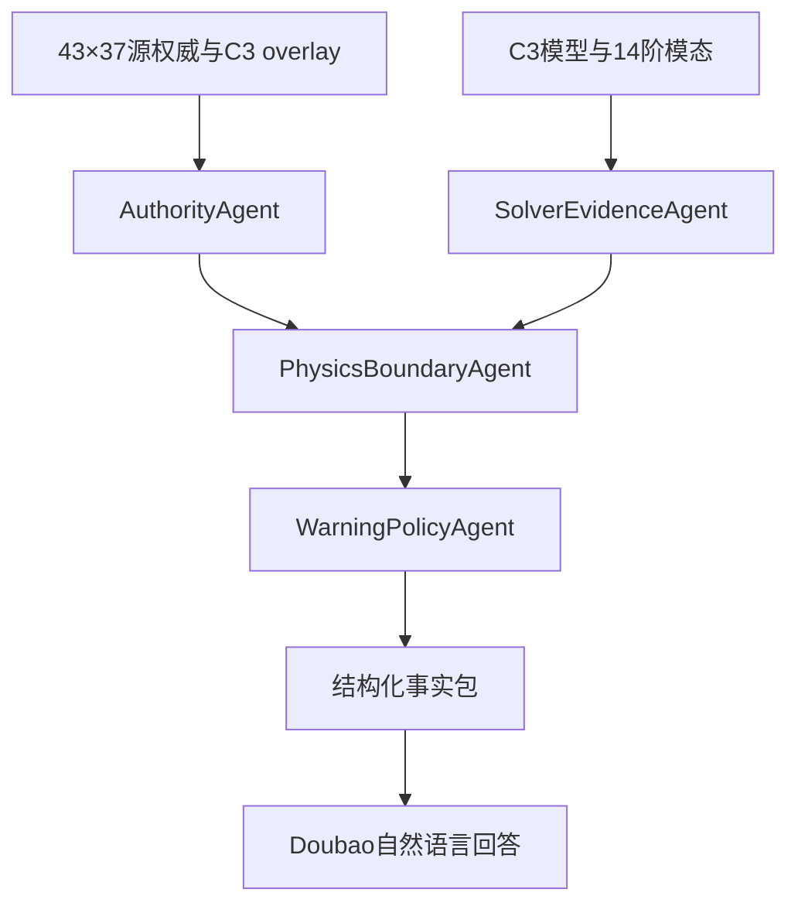

# C3 43 工况图谱与智能体说明

## 数据流

`authority/I08_GITHUB_43_CASE_MATRIX.csv` 保留完整 43 × 37 源权威；`case_migration_matrix.csv` 将源事实映射到 `cases_43.csv` 的 C3 overlay；`model_binding.json` 提供 C3 模型和模态事实；`c3_agent.py` 对每个工况执行四个确定性智能体，然后构造可查询的事实包。

## 迁移规则

- 完整 43 × 37 I08 权威矩阵进入新图谱的 provenance 层；源名称、源分类、原始顺序均保留，C3 名称、eligibility 和展示顺序作为独立 overlay。
- `source_case_index` 是 I08 顺序，`c3_order` 是 C3 顺序。43 个 ID、U10、阵风和等级逐行核对，但顺序列不互换。
- 源矩阵分类为 35 个 `stationary_ok` 和 8 个 `reference_only`；C3 overlay 为 33 个 `stationary_eligible` 和 10 个 `envelope_only`。仅 `cape_denison_katabatic`、`piteraq_tasiilaq` 两项属于 `C3_ENVELOPE_ONLY_RECLASSIFIED`。
- 四智能体规则在 C3 证据上重新执行，每个工况生成 4 个新决策，共 172 个；迁移的是规则契约，不是旧决策数值的复制。
- C3 deck、求解器、DAT、14 阶模态和哈希进入模型证据节点。
- Double‑MCT 源包的 36 个资产已由 `source_asset_inventory.json` 逐项记录 Git blob、SHA‑256、大小和处置方式。
- Double‑MCT 的 43 个结果仅生成完整 `LegacyResultPointer` 和 `ResultEvidenceBundle` 来源链；旧图谱中的 2,064 个数值 `MetricObservation` 被有意排除，不进入 C3 图谱。
- C3 的 43 个 `CaseResponse` 节点状态统一为 `NOT_MATERIALIZED`。
- C3 的 10 个 envelope-only 工况输出 `REFERENCE_ONLY_C3_ENVELOPE`；其余 33 个工况输出 `AWAITING_C3_CASE_RESPONSE`。该 C3 决策不能倒推为源分类变更。
- 43 个最终状态均为 `NOT_ARMED`，且 `dispatch=false`。

## 权威文件哈希

源分支中的矩阵采用 CRLF 换行，原始 SHA‑256 为 `12673049d2cfae885fb5a35d855441e7385b644d1182a7cc020d5e49f5e28b7f`。迁移目录保存 LF 规范化副本，其 SHA‑256 为 `95fe97e73b3bec61124147b9c29a4ed3abf6217537e8bf082eca707426f3625a`。验收同时绑定两个哈希并显式记录换行规范化，因此不会把 LF 副本误称为源文件的字节级复制。

## 模态配对边界

`table41_c3_pairing.csv` 中 M3/M4/M10/M14 均为 `NOT_ALIGNED` 比较候选，不是工作配对。当前只绑定 C3 FT14 的 14 阶原生模态，没有绑定可复核的 80 阶 C3 模态产物；因此这些候选不能进入已确认的模态事实，也不能作为 C3 抖振响应已验证的依据。

## 查询范围

Demo 可以回答：工况事实、风速相对量级、C3 模型身份、原生模态、四智能体路径、当前缺失证据、旧结果为何不能转抄。

Demo 不输出：C3 位移 RMS、C3 索力、C3 支反力、C3 安全比、正式运行预警等级。模型迁移完成仅表示语义、权威、规则、来源和 C3 模型绑定通过验收，不表示 C3 原生 43 工况风荷载或结构响应已经计算。

## Doubao 接口

调用使用火山方舟 OpenAI 兼容 Chat API：`/api/v3/chat/completions`。默认模型为 `doubao-seed-1-8-251228`。系统消息要求模型只依据结构化事实包作答，并保留 `NOT_MATERIALIZED`、`NOT_ARMED` 和 `dispatch=false`。

## GitHub Demo

推送本目录或工作流后，Actions 自动执行：

1. 重建图谱；
2. 校验 43 工况、172 决策和所有边端点；
3. 运行单元测试；
4. 生成两个离线问答；
5. 检测仓库 Secret 并调用 Doubao；
6. 上传完整 `generated/` 与 Demo JSON。
