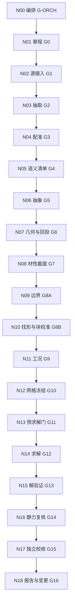

# 送审方案：在 `974211b2` 上叠线形（不换主）

评估人：Cursor Grok 4.6。本文件是**方案**，不是本轮求解记录。不改 `974211b2`，不改 `760c0ee4`，不 push `main`，不开新 PR，不合并，不扭到 `demo-rl-calculix`。不编 S10 索力，不把附件 2-3 频率写进目标函数。

对照路径（只加已给源）：

| 角色 | 已给路径 | SHA-256 / 状态 |
|---|---|---|
| 本方案宿主主 | `catwalk-fem/artifacts/zjg_catwalk_migrate_main.inp` | `974211b2ddfe2950548ee2455bc22e1e2e68d3e1f53df4c4e1eb71ece0267fd1` |
| 预应力与二维等效几何 | `catwalk-fem/mct-from-zero/source/01_设计资料与规范/猫道 - 门架索合建模型2.mct` | `0d18e3f7b009e0306fb4b9f3051b4a16d05fa24d9e966774e809b8942a4f22e1` |
| 对照员（抽不出索力） | Release `catwalk-attachment23-v2.0-s10-20260716` 的 `cw_S10_0716t050342_a4_eq.db` | `17e0bac8717e7c32a407571d33e38dd777736b31b6656684e53449fa8c9d40fd`；`eval/SIDECAR_S10_DB_NO_CABLE_FORCE.json` |
| 冻结对照谱 | 附件 2-3 → `catwalk-fem/isolated/TARGET-FREQ.json` | 只许求解冻结后再打开 |
| 流程主干 | `bridge-fem-skill-suite/` 的 N00–N18 | `workflow.yaml` 不改节点顺序 |
| 自制 STEP 清分量现场 | `catwalk-fem/artifacts/zjg_catwalk_cleared.inp` | `760c0ee4…b0585de9`，**本方案不动** |

机器表：`eval/SCHEME_974211b2_LINE_OVERLAY.json`。

同分支已有回读（不是本文件、也不替代本文件）：`eval/plan_974211b2/` 已从 MCT 扒四跨线形，并证明宿主 IC 与 MCT \(F/A\) 的 PK2 相对差 \(\le 4.758\times10^{-7}\)。那是**一次交换的回读**，不是 19 skill 主干，也还没有八块 \(\kappa\) / 影响矩阵 / PSO。线性步仍不平衡。本方案接在那次回读之后，不重做扒线，不换主。

---

## 0. 意图：不是把用户的词贴成脚本

用户要的不是「听到网格 / PSO / 端到端就去重划一套单元」。他要的是：

1. **先有一条别人也能审的逻辑主干。** 仓库里这条主干已经写死了：N00 编排，N01–N18 依次出不可变工件，Gate 只有 `PASS` / `PASS_WITH_BOUNDS` / `BLOCKED` / `NOT_APPLICABLE`。
2. **主干本身不加新实验分支。** 所谓详细方案，只是在每一步已经规定好的位置，填上本桥现在真正有的模型、对照员和实验设置。
3. **网格那句话的意思是降维，不是再网一次。** 先用视觉/语义把区域锁成 N 块；锁住之后只交换一次；PSO 只在这 N 维上校准。目的是少重网，不是换主。
4. **主仍是 `974211b2`。** 线形叠在它上面。不把自制 STEP 的 `760c0ee4` 改成计算主，也不另写一张替换它的新主。

本岗自己对完文献、19 个 skill 和现有数字以后，把这句话落实成下面三件事。这是改良，不是改词。

| 用户片语 | 本方案落实 | 为什么这样比字面执行更合理 |
|---|---|---|
| 视觉上快速锁成 N 块 | 用 MCT 已有的 8 个 `*GROUP`（4 跨 × 2 索族）当块，不用均匀图像格子 | N05/N06 要求按传力路径和构件角色分区；MCT 组名已经是这条路径 |
| 里面只存在一个降维 | 搜索空间从 1123 根 TENSTR 降到 \(N=8\) 个块比例 \(\kappa_b\) | 1123 维 PSO 会过拟合 MCT 噪声，也等于每步重做一张力场 |
| 锁定之后只交换一次 | 一张 overlay sidecar：拓扑、节点号、单元号冻结；只允许改块比例与针点目标残差 | N12 规定正式求解前冻结网格；N00 重试不得改网格物理含义 |
| PSO 校准 | 先做 8 次单位扰动影响矩阵，再让 PSO 只吃残差；矩阵已够则 PSO=`NOT_APPLICABLE` | 斜拉桥/悬索找形文献的主流是「影响矩阵 + 智能算法」，不是裸 PSO 打满求解器 |
| 缩小重网次数 | `974211b2` 的 1125 节点 / 1194 单元不再重划；`760c0ee4` 只当 N17 独立网格 | 自制 STEP 5 万节点重网一次，比 MCT 二维等效贵两个数量级，且与 MCT 无 1:1 |

---

## 1. 为什么是这条主线

两条独立理由叠在一起，才构成「合理方案」，而不是用户贴了几个字。

**仓库理由。** `workflow.yaml` 把找形放在 N10（G8B），把网格冻结放在 N12（G10），把求解器重试限制在 N12 已批准的数值序列。N10 明文禁止无约束地同时指定目标线形、目标索力和无应力长度。N07 要求设计几何与分析几何分开，回投 overlay。N17 要求独立方法至少占「方法 / 实现 / 数据解释」三维中的两维。所以：线形是独立控制量，块比例是校准量，无应力长度是结果；网格锁在宿主上；对照员不得回写成输入。

**对象理由。** `974211b2` 已是 MCT 正文迁出的 CalculiX 静力 deck（与 `mct-from-zero/artifacts/mct_from_zero_static.ccx.inp` 字节相同）。MCT 是 Y≈0 的单线二维等效，1123 根 TENSTR 都有 `*INIFORCE`，71 榀门架 TRUSS 没有。第一次 ccx 2.21 线性步已经跑过：方程 30932，步完成，但 \(|U|_{\max}\approx 9.26\times10^9\) mm，`eval/ccx_mct_from_zero/ccx_run.json` 写明 **不是平衡索力态**。IC 剥掉自重/二期再探，仍然不平衡。缺的不是另一张网，而是：在已经对上表 1-9 的节点坐标上，找回使自重+二期后仍停在这条线上的块张力。

**文献理由（用来改良，不拿来编数）。**

- 目标构形法：已知成桥线形，反求无应力长度或初张力，使恒载平衡回到该线形（Kim & Lee, *Computers & Structures*, 2001；悬索安装找形的 IPSO，ASCE *J. Comput. Civ. Eng.*, 2014）。
- 影响矩阵：用少量单位荷载/单位张力扰动代替每一代全模型重分析（斜拉桥索力优化的常规做法；影响矩阵 + PSO/GA，*Appl. Sci.* 2023；东南大学学报 2024）。
- 仓库理论包：抛物线 \(H=wL^2/(8h)\)，\(h=227.300\) m，禁止 255.56 m；L0 只作量级门，\(f_n=n\sqrt{g/32h}\)。
- NASA-STD-7009B / ASME V&V 10（skill 官方源）：用途、独立验证、不确定度分开写；本方案的 intended use 只到「静力平衡 + 线形针点」，不到十四阶谱。

---

## 2. 已核实、不编的硬事实

本岗当场复算，不引入新源。

### 2.1 宿主

```
974211b2ddfe2950548ee2455bc22e1e2e68d3e1f53df4c4e1eb71ece0267fd1  zjg_catwalk_migrate_main.inp  (930300 B)
```

`*HEADING` 写明：来自《猫道 - 门架索合建模型2.mct》，CalculiX 单位 N·mm，IC 为 ccx 2.21 §7.76 八字段。节点 1125，单元 1194（TENSTR 1123 → T3D2，TRUSS 71 → B31）。

### 2.2 线形已经在宿主上，不必为了对表 1-9 再网一次

MCT 的 \(X\) 是「桩号相对 K16+000」的毫米；自制 STEP 路径的 \(x=\)桩号\(-K16+876\)。换算是恒等：

\[
X_{\mathrm{MCT}}=1000\,(x+876),\qquad
x=X_{\mathrm{MCT}}/1000-876.
\]

禁止再减 \(X_{\min}\)。针点在 MCT 节点表上**精确命中**复核报告表 1-9 / `pipeline/constants.py`：

| 针点 | 桩号 | 宿主节点 | \(X_{\mathrm{MCT}}\) (mm) | \(Z\) (mm) | 自制 \(x\) (m) |
|---|---|---:|---:|---:|---:|
| 门架北锚 | K16+831.091 | 1001 | 831091 | 44310.00 | −44.909 |
| 面层北锚 | K16+852.105 | 1 | 852105 | 28152.00 | −23.895 |
| 北鞍 | K17+542.679 | 157 | 1542679 | 340600.00 | 666.679 |
| 北下拉（垂点） | K17+553.300 | 160 | 1553300 | 334645.00 | 677.300 |
| 主跨跨中 H1 | K18+686.000 | 302 | 2686000 | 113300.00 | 1810.000 |
| 南下拉（垂点） | K19+818.700 | 444 | 3818700 | 334537.00 | 2942.700 |
| 南鞍 | K19+829.321 | 447 | 3829321 | 340600.00 | 2953.321 |
| 门架南锚 | K21+101.700 | 1395 | 5101700 | 41317.00 | 4225.700 |

21 个 `横向通道节点` 换成自制 \(x\) 后，与 `PASSAGE_X` 的 159, 330, 501, …, 4014 **逐站重合**。所以「叠线形」在本桥上的正确读法是：

> 把 `974211b2` 的 `*NODE` 冻结成目标构形，而不是再生成一套坐标。缺的是力，不是形。

`垂点组` = {160, 302, 444}。下拉点按章程只作边界敏感性，不默认成支承。

### 2.3 八块（视觉锁）已经在 MCT 里

| 块 | MCT `*GROUP` | 单元数 | 索族 | 理论跨别名 |
|---|---|---:|---|---|
| B1 | 北边跨 | 149 | 猫道承重索 | 北侧 660 m |
| B2 | 主跨 | 295 | 猫道承重索 | 主跨 2300 m |
| B3 | 南边跨 | 160 | 猫道承重索 | 南侧 717 m |
| B4 | 南辅跨 | 115 | 猫道承重索 | 最南 503 m |
| B5 | 门架索北边跨 | 64 | 门架承重索 | 同 660 m |
| B6 | 门架索主跨 | 216 | 门架承重索 | 同 2300 m |
| B7 | 门架索南边跨 | 67 | 门架承重索 | 同 717 m |
| B8 | 门架索南辅跨 | 47 | 门架承重索 | 同 503 m |

B1–B4 合计 719 = `索验算`。B5–B8 合计 394 = `门架索`。71 个 `门架` TRUSS **不进** \(\kappa\)（MCT 无 INIFORCE）。跨名冲突只记别名：主键用 MCT 组名，理论包用「南侧 717 / 最南 503」。

### 2.4 对照员

- MCT `*INIFORCE` 1123 条，轴力 1482.74–15724.3 kN，和 `*INI-EFORCE` 相对差均值 \(3.3\times10^{-6}\)。这是本方案唯一允许进入 \(\kappa=1\) 初值的力表。
- S10 `.db` 700 186 624 B，本环境无 MAPDL；全文 ASCII 探针 INISTATE/LINK180/PRESTRESS 均为 0。索力表保持 `null`。归档 APDL/oracle 的 LINK180 不是 `.db` POST1，不得当抽出值。
- MCT 与 S10 网格不同（1194 vs 约 7.4 万 LINK180），禁止 1:1 单元映射。
- 附件 2-3 十四频在 `isolated/`。写入器、PSO、影响矩阵都不得 import。
- `760c0ee4` 是自制 STEP 清 4 个 B31 分量的现场，本方案不改字节，只允许 N17 当「另一张网」对照。

---

## 3. 逻辑主干（固定，不改 skill 顺序）



条件分支：N10 必开（`requiresInitialState=true`）。变更从首个受影响节点重跑，并强制复评 G11、G13、G15、G16。求解不收敛只许走 N12 已批的 cutback，不许改材料、边界、荷载、连接、初张力物理含义或网格。

这就是用户说的「包/网站/仓库里很固定的那套流程」。下面第 5 节只在每一步**加上**本桥设置。

---

## 4. 一次交换与 PSO：力学上怎么走

### 4.1 一次交换（swap-once）

交换的对象是**场**，不是网。

1. 读 `974211b2`，记下节点号、单元号、ELSET、截面、边界、IC 行数。宿主文件本身只读。
2. 建 `overlay_map.json`：每个 TENSTR 属于 B1–B8 之一；每个针点绑定宿主节点号与目标 \(Z\)（上表，来自 MCT 节点 = 表 1-9）。
3. 写**一张** sidecar deck（建议名 `zjg_catwalk_migrate_overlay.inp`，新哈希，**不覆盖** `zjg_catwalk_migrate_main.inp`）：
   - `*NODE` / `*ELEMENT` 与宿主同一套 ID；
   - `*INITIAL CONDITIONS` 仍是 §7.76 八字段，\(\sigma_e=\kappa_{b(e)}\,T_e^{\mathrm{MCT}}/A_e\)，再投到全局 PK2；
   - 针点用目标构形：或保持坐标并把针点 \(Z\) 写入 overlay 报告，或对鞍/锚施加与 MCT `*CONSTRAINT` 相同的自由度。
4. 此后禁止第二次改拓扑、禁止加密、禁止把 Y≈0 扩成双幅。

「只交换一次」禁止的是：每轮 PSO 重划单元、每轮改节点号、把自制 STEP 节点缝进 MCT、为了对 S10 三维网而重做二维等效。

### 4.2 降维变量

\[
T_e=\kappa_{b(e)}\,T_e^{\mathrm{MCT}},\qquad
\kappa_b\in[0.5,1.5],\qquad b=1,\ldots,8.
\]

消融（N17 敏感性，不是主干分叉）：

- \(N=8\)：主设置。
- \(N=4\)：每跨一个 \(\kappa\)（两索族同比例）。
- \(N=2\)：只分猫道索 / 门架索。
- 禁止 \(N=1123\)。

71 门架 \(\kappa\) 固定为「无预应力杆」，不发明轴力。

### 4.3 目标（N10 独立控制量 = 线形）

主度量：针点竖向残差

\[
J_z=\sqrt{\frac{1}{|\mathcal{P}|}\sum_{p\in\mathcal{P}}(z_p-z_p^\star)^2},
\]

\(\mathcal{P}\) = 上表鞍/跨中/锚 ∪ 21 个通道节点 ∪ 垂点组。\(z_p^\star\) 来自宿主节点表（已对表 1-9），不是编出来的第三套线。

正则：块内力不要离开 MCT 表

\[
J_T=\sum_b\bigl(\kappa_b-1\bigr)^2.
\]

合目标 \(J=J_z+\lambda J_T\)。\(\lambda\) 的名义值 0.05，低/高 0.01 / 0.20（ASSUMP，N17 扫）。约束：所有 TENSTR 轴力 \(>0\)；\(|U|\) 在针点处小于章程容差。

**不进 \(J\)：** 附件 2-3 频率、S10 oracle LINK180、255.56 m、自制 STEP 位移。

### 4.4 影响矩阵先于 PSO（改良）

对每个块做一次单位扰动 \(\kappa_b\leftarrow\kappa_b+\delta\)（\(\delta=0.02\)），在冻结网上跑同一 NLGEOM 静力步，记录针点 \(\partial z_p/\partial\kappa_b\)。得到 \(21{+}8\) 行 × 8 列的影响矩阵 \(A\)。先解

\[
\min_\Delta\lVert A\Delta+r_0\rVert^2+\lambda\lVert\Delta\rVert^2,\qquad
\kappa\leftarrow\mathrm{clip}(1+\Delta,[0.5,1.5]).
\]

若此时 \(J_z\) 已低于 G8B 容差，**不再开 PSO**（N10：目标已满足，禁止为了「用过 PSO」继续打求解器）。否则 PSO 只在该最小二乘点的邻域搜残差。

PSO 实验设置（主设置，不是第二套主干）：

| 项 | 值 | 依据 |
|---|---|---|
| 维度 | 8 | MCT 八组 |
| 种群 | 16 | \(2N\) |
| 最大代数 | 40 | 预算上限；可早停 |
| \(w,c_1,c_2\) | 0.72, 1.49, 1.49 | Clerc 收缩系数常用点 |
| 边界 | \(\kappa\in[0.5,1.5]\) | 不离开 MCT 力表量级 |
| 初值 | \(\kappa=1\) 与 \(H=wL^2/(8h)\) 块均值比，两颗种子 | N10「解析初值只用于收敛」 |
| 早停 | \(J_z<\) 容差连续 5 代，或 8 次矩阵扰动后已过门 | 少重分析 |
| 种子 | 974211b2 的十进制前 8 位 `974211b2` → 2537213874 | 可复放 |
| 每颗粒子 | 同一张 overlay 拓扑，只改 IC 比例 | 零重网 |

解析种子（已有 `artifacts/initial_state.json`，不编）：主跨成型 \(h=227.300\) m，\(L_{\mathrm{saddle}}=2286.642\) m，\(w_{\mathrm{floor}}=2.766\) kN/m，\(H_{\mathrm{floor,deck}}=7953.5\) kN。MCT 单根 TENSTR 均值 7966.7 kN 是**整桥二维等效一根**，与「16 根面层索再均分」不是同一口径；种子只用**块内 MCT 均值的比例**，禁止把 7953 kN 直接写成 16 根里的一根。

### 4.5 求解设置（N12 冻结，N14 执行）

- 求解器：CalculiX 2.21，不得换成 demo 算例。
- 第一步必须 `*NLGEOM`。已有线性步飞掉的证据，禁止再把线性静力当正式找形。
- 增量：初值 0.1，最小 1e-4，最大 1.0；Newton；力/位移残差按 N12 表冻结。
- 重试：只许减小增量、增加迭代上限。不许改 \(\kappa\) 的物理定义，不许改网。
- 已求解只承认：exit 0 且 `.frd` 有 DISP 且 `.sta` 有收敛增量，并且 \(J_z\)、轴力符号过门。程序返回 0 不够。

---

## 5. 主干每一步的实验设置

下面不增加节点。每一格是「这个 skill 在本桥上要吃什么、出什么、怎样才算过」。

### N00 · 编排 · G-ORCH

- **设置：** `runId=zjg-catwalk-974211b2-overlay`。内部单位：宿主 N·mm；对照章程米制时只通过一个换算入口。激活 N10。
- **输入哈希：** 宿主 `974211b2`，MCT `0d18e3f7`，S10 db `17e0bac8`，本方案 JSON 自身哈希。
- **禁止：** 跳过 G8B/G10/G11；把 `760c0ee4` 当本 run 宿主。
- **产物：** `run_plan.json`，`gate_ledger.json`，`artifact_lineage.json`。

### N01 · 章程 · G0

- **intended use：** 「施工猫道一次成桥静力态下，计算自重+二期+块校准预应力引起的线形与索力，支撑『宿主网是否停在表 1-9 针点上』这一决策；对象为 MCT 二维等效；精度为针点 \(J_z\)。」
- **纳入：** 几何非线性、拉力单向、初张力、二期 `*CONLOAD`。
- **排除：** 模态/抗风谱、双幅三维、S10 实体、疲劳、地震。排除项不得用静力过门冒充。
- **验收（有来源）：**
  - 北/南鞍 \(Z=340.600\) m、跨中 \(Z=113.300\) m：CALC-INPUT 表 1-5/1-9，容差名义 50 mm（理论包表 1-9 拟合 RMS 量级 38–78 mm；N17 对 30/50/80 mm 做包络）。
  - 21 通道节点 \(x\) 与 `PASSAGE_X` 重合（已是 0），容差 12 m 只用于「找错节点」，不得用于放宽 \(Z\)。
  - 全部 TENSTR 轴力 \(>0\)。
  - 禁止 255.56 m 进入 deck。
- **产物：** 新版 `analysis_charter.json`（新 runId，不覆盖旧 homemade 章程的历史含义）。

### N02 · 源摄入 · G1

- **设置：** 只登记已给四源 + 19 skill 包。MCT 用中文路径，禁止 Unicode 转义文件名。S10 `.db` 记 `bytes=700186624`，`extracted_cable_force=false`。附件 2-3 记为 isolated，不进 `source_files` 的求解子集。
- **产物：** `source_manifest.json`（哈希闭包）。归档目录 `03_猫道动力分析/MCT基准复现_V1.0/` 只作索引，CSV **不是**新主。

### N03 · 抽取 · G2

- **设置：** 从 MCT 正文抽 `*NODE` `*ELEMENT` `*INIFORCE` `*INI-EFORCE` `*GROUP` `*CONSTRAINT` `*SELFWEIGHT` `*CONLOAD`。从章程/理论包抽表 1-9 针点（已在 `constants.py`）。S10 `.db` 不二次编表。
- **产物：** `extracted_tables.json`（1123 力、8 组计数、针点表）。

### N04 · 配准 · G3

- **设置：** 两套坐标并列登记，不得静默混用。回投：宿主节点 157/302/447 对表 1-9 的偏差必须是 **0 mm**（已核实）。跨名冲突写入 `conflict_register`，主键 MCT 组名。
- **CRITICAL 不得留到 N07：** 若有人用 \(X-X_{\min}\) 对站，G3=`BLOCKED`。

### N05 · 语义清单 · G4

- **设置：** 构件组 = B1–B8 + `门架` + 锚/鞍/通道针点。传力路径：锚 → 承重索 → 门架索/门架 → 通道站。两幅在 MCT 里是单线等效，禁止再镜像出第二幅自由度。
- **产物：** `component_inventory.json`，`load_path_graph.json`。

### N06 · 抽象 · G5

- **设置（四类处置）：**
  - 保留：TENSTR 轴向、门架 B31、INIFORCE、二期节点力、MCT 约束。
  - 等效：面网/踏板已在 MCT 重度与二期里，不另建膜。
  - 排除：S10 三维网片、双幅 42.90 m。
  - 参数化：\(\kappa_b\)、\(\lambda\)、针点容差。
- **批准：** 分析几何 = 宿主节点；设计几何 = 表 1-9 针点。二者在针点处已重合，仍分开存，满足 N07 规则 1。

### N07 · 几何 · G6

- **设置：** 不生成新中心线。`fem_geometry_ir` 的节点坐标 = 宿主 `*NODE`。`geometry_overlay_report` 列出第 2.2 节针点偏差（期望全 0）。Y 保持数值 0，不发明横向坐标。
- **一次交换的几何半步在这里签发：** overlay 只读宿主，写出 map，不改 `974211b2`。
- **BLOCKED：** 任何「为了对 S10 而重划 1125 节点」的提案。

### N08 · 材性截面 · G7

- **设置：** 原样用 MCT：猫道索 \(E=120\) kN/mm²，\(D=168.498\) mm，\(A=\pi(D/2)^2=22298.69\) mm²；门架索 \(D=103.436\) mm，\(A=8402.98\) mm²；门架 2 根 B 160×4，\(A=9792\) mm²。密度按 `emit_ccx.py` 已登记公式，不改。
- **对照：** 自制路径 `ROPE_FLOOR` 是 φ50×16 根口径，与 MCT 单根等效直径不同。N17 只许比 \(EA\)、比总 \(H\)，禁止把两套 \(A\) 填进同一张截面卡。

### N09 · 边界 · G8A

- **设置：** 照抄 MCT `*CONSTRAINT`：
  - `111000`：1, 154, 450, 728, 729, 730, 1001, 1066, 1280, 1395；
  - `011000`：3, 6, 157, 447, 608, 723, 726, 1003, 1063, 1283, 1347, 1393。
- 鞍点 157/447 在第二组（纵桥向可滑），不要改成三向钉死——那会换机制。
- 下拉点 160/444 默认不钉；N17 做「钉 / 不钉」包络。
- 已有 `n_uy_plane_added=1103` 的平面约束是二维等效所必需，保留并记账。

### N10 · 找形 · G8B

- **独立控制量：** 目标线形 = 宿主针点 \(Z\)。从属量：\(\kappa_b\)、无应力长度、平衡后索力。
- **算法顺序：** 解析种子 → 8 次影响矩阵 →（必要时）PSO 残差。见第 4 节。
- **自重：** MCT `*SELFWEIGHT` gz=−1 与二期 `*CONLOAD` 只计一次，禁止再叠加 `FLOOR_SYSTEM_KNPM`。
- **产物：** `initial_state_ir.json`，`form_finding_report.json`，`target_geometry_comparison.json`，`prestress_and_lock_in_ledger.json`（1123 行 × 8 块归属）。
- **G8B：** \(J_z\) 过容差、轴力为正、无外载扰动下可再平衡、算法与阈值已冻结。部分 \(\kappa\) 发散或出现压力 → `BLOCKED`。

### N11 · 工况 · G9

- **本 run 正式工况只有一个：** `LC-DEAD-PRESTRESS` = 自重 + 二期 + 校准 IC，`*NLGEOM`。
- **登记但不在本 run 求解：** `LC-PERSONNEL-UNIFORM`、`LC-WIND-Y`、`LC-FREQ`。频率步在 G8B/G13 静力未过之前 `NOT_APPLICABLE`。
- **合力账：** 二期 FZ 总和已在 MCT sidecar：−4725.567874 kN（764 个非零）。预求解必须回读到同一数量级。

### N12 · 网格与数值 · G10

- **baseline = 宿主本身。** 粗/细网格不在本宿主上重划。
- **等价收敛计划（经批准，避免重网）：**
  - coarse：\(N=2\) 或 \(N=4\) 消融；
  - baseline：\(N=8\)；
  - fine / 独立：`760c0ee4` 自制网只读对照（N17），不把结果写回宿主。
- **强制节点：** 已在 MCT 组与针点上，不再插入。
- **数值：** NLGEOM，增量 0.1 / 1e-4 / 1.0，SPOOLES 或同等对称求解器。稳定阻尼、质量缩放禁止用于掩盖不平衡。
- **T3D2 积分点：** 继续 8 点写 PK2，与现迁格式一致。

### N13 · 预求解 · G11

- **检查：** 单位 N·mm；ID 唯一；1123 IC 行覆盖全部 TENSTR；71 门架无 IC；无零长；连通分量与 MCT 约束相容；二期合力闭合；deck 全文无 255.56、无 isolated 频率数字。
- **量级门：** 轴力 1e3–2e4 kN；跨度 4 km 量级；\(Z_{\max}=350312\) mm。线性飞飞位移不得当作「已检查过」。
- CRITICAL 未关禁止进 N14。

### N14 · 求解 · G12

- **设置：** 干净目录，唯一 `SOLVE-ID`。只映射 FEM-IR。官方 ccx 2.21。
- **记录：** stdout/sta/cvg/frd 哈希。`matches_host_topology=true` 必须可复算。
- **不声称：** 把 `ccx_mct_from_zero` 那次线性飞飞写成科学结果。它只证明「需要本方案」。

### N15 · 解验证 · G13

- **设置：** 反力闭合、针点 \(J_z\)、最小轴力、能量、增量收敛。网格收敛用第 N12 的 N=4/8 消融，不另网。
- **禁止** 事后改用「比较好看」的指标替换失败的 \(J_z\)。

### N16 · 静力复核 · G14

- **设置：** 索力保持拉力；线形、水平分力、垂度、锚反力同一 ISTATE。本 run 不做规范承载力签发。人员/风组合标 `NOT_APPLICABLE`。

### N17 · 独立校核 · G15

三维里至少占两维：

| 维 | 本桥做法 |
|---|---|
| 方法独立 | \(H=wL^2/(8h)\) 与 L0 量级门；四跨开放段曲率拟合（理论包已有 RMS） |
| 实现独立 | 不调用 `emit_ccx.py` 写 IC 的同一函数路径；独立脚本从 MCT 正文重读 INIFORCE |
| 数据独立 | 表 1-9 从 `constants.py` / 理论包读，不从 overlay deck 反抄 |

对照员：S10 `.db` 继续「抽不出」；不得用 oracle CSV 填洞。`760c0ee4` 可作「另一实现的拓扑」，但无 1:1，只比针点高程与总反力量级。

敏感性：\(\kappa\) 边界、\(\lambda\)、下拉点钉/不钉、\(N=4/8\)、容差 30/50/80 mm。

### N18 · 报告 · G16

- **设置：** 发布包写明允许用途 = 静力针点平衡；未覆盖 = 谱、双幅、S10 实体。变更图：改 MCT 正文或改 \(\kappa\) 定义要从 N10 重跑；改容差只复评 G8B/G13/G15/G16。
- **本文件本身**是送审稿，不是 release candidate。

---

## 6. 明确不做

- 不改 `zjg_catwalk_migrate_main.inp` 字节，不换主。
- 不改 `760c0ee4` / `c635dad7` / `41fb3222` / `82548e6a`。
- 不把 S10 `.db` 编成 LINK180 索力表。
- 不把附件 2-3 频率送进 PSO、影响矩阵或 `write_inp`。
- 不把 255.56 m 当猫道垂度。
- 不把 Y≈0 扩成 ±21.45 m 双幅（那是另一张网，等于重网）。
- 不把 `demo-rl-calculix` 或其它玩具 deck 当本桥验证。
- 不把 VM 跑通写成科学复现。
- 不 push `main`，不开第二条 PR，不合并 #19。

---

## 7. 送审怎么读、怎样才算执行过门

审的是方案，不是本轮位移。独立复算命令：

```bash
git fetch origin cursor/catwalk-main-deck-gate-f23d
git show origin/cursor/catwalk-main-deck-gate-f23d:catwalk-fem/artifacts/zjg_catwalk_migrate_main.inp | sha256sum
# 期望 974211b2ddfe2950548ee2455bc22e1e2e68d3e1f53df4c4e1eb71ece0267fd1
git show origin/cursor/catwalk-main-deck-gate-f23d:catwalk-fem/artifacts/zjg_catwalk_cleared.inp | sha256sum
# 期望 760c0ee44d7077ddfb84273cba916abb1fea1eb2a0ff6cfe57abaec9b0585de9
python3 catwalk-fem/tests/test_scheme_974211b2_overlay.py
```

以后若有人执行本方案，过门顺序只有：N13 预求解 → N10/N14 的 NLGEOM 静力 → \(J_z\) 与轴力符号 → 才允许谈 N17 → 更后面才允许打开 isolated 频率。任何一步重网、换主、编 S10 力，都算方案被破坏，而不是「跑得更完整」。
